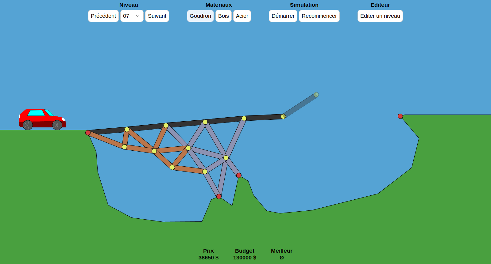

# Ponts

A java bridge building game



This project was made by three students at INSA Lyon for second year computer science class.

In the game, you build your bridge and launch the simulation to see if it will be solid enough for the car to cross it. You can build from 3 different materials (wood, steel and tarmac) with different proprieties, but beware not to exceed the budget. The game includes 10 levels, and a level editor to create even weirder terrains.

## Credits

The game uses the [JBox2D](https://github.com/jbox2d/jbox2d) library for the physics, an open source port of the C++ library [Box2D](https://box2d.org/).
For the graphics, it relies on Swing with a modern theme provided by the [FlatLaf](https://www.formdev.com/flatlaf/themes/).

The game is heavily inspired by [Poly Birdge](http://polybridge.drycactus.com/), a very cool game developed by Dry Cactus.

## Running the game

Requirement : Java 11 or above

Download the file named `Ponts.jar` in the Releases section, and run it in the terminal by typing :

```bash
java -jar Ponts.jar
```

### Linux only

Give execute permissions to `complile.sh` and `execute.sh` scripts, and run them in this order :

```bash
chmod +x complile.sh execute.sh
./complile.sh
./execute.sh
```

### Alternative

You can run the project by openening it inside VS Code with the Extension Pack for Java installed.

## Saving and loading bridges

Bridge designs are stored as JSON under `res/bridges/`.

- **Save bridge** — Only works while the simulation is **paused** (or before you have started it). You are prompted for a file name; invalid characters are sanitized and the file is written as `res/bridges/<name>.json`.
- **Load bridge** — Also requires the simulation to be stopped. A dialog lists existing `.json` files in `res/bridges/`. If the file was saved for a different level shape than the one you have open, the game warns you before loading.

The save format stores **joints** (world `x`, `y`, and whether the joint is **fixed** to the terrain) and **edges** (which joints they connect and **material**: asphalt, wood, or steel). A level fingerprint may be included so the game can detect mismatched levels.

## Recording a simulation run

While playing a level you can record how the car progresses and export that data for analysis or plotting.

1. Enable **Record run** in the Bridge file section. With recording on, each physics step while the simulation is running appends a sample (simulation time, progress, rear wheel position, and step `dt`).
2. **Progress** is a value between `0` and `1`: the rear wheel’s horizontal position mapped along the span from the **leftmost** to **rightmost** bridge **anchor** on the level. If there are no anchors (or the span is degenerate), the game falls back to the same terrain span used for the car start and finish.
3. Click **Save run…** to write `res/simulations/<name>.json`. The file includes the level name, anchor span (`minX` / `maxX`), and an array of samples: `t`, `progress`, `rearWheelX`, and `dt`.

Recording is tied to the current session; changing level or restarting clears the in-memory buffer (enable **Record run** again before the next run if you want to capture it).

### Physics timestep

The simulation advances with a **fixed** step of `1/60` second per physics tick (both in the GUI and in headless mode). The GUI timer fires about every 16 ms and applies one such step per tick, so behavior is stable and does not depend on wall-clock jitter.

## Headless simulation

You can run the physics **without the GUI** to batch many steps quickly. This requires a **level name** (file under `res/niveaux/`), a **bridge JSON** path, and a **maximum number of timesteps**. Output is written to `res/simulations/<uuid>.json` (a random UUID as the file name).

From the project root, after `sh compile.sh`:

```bash
java -cp .:lib/jbox2d-library-2.2.1.1.jar:lib/flatlaf-2.1.jar bridge.Main --headless --level <levelName> --bridge res/bridges/<name>.json --max-steps 100000
```

Or use the helper script (from the project root, after `compile.sh`):

```bash
chmod +x execute_headless.sh
./execute_headless.sh --level <levelName> --bridge res/bridges/<name>.json --max-steps 100000
```

On success, the absolute path of the new JSON file is printed to standard output. The file contains the same sample fields as a GUI **Save run**, plus `headless: true`, `maxTimesteps`, `timestepsRun`, and `sessionFinished` (whether the car run ended naturally before hitting the step limit).

## Demo

[screencast](https://user-images.githubusercontent.com/32977249/201428102-d889df1f-99a6-46f5-9da4-680b92a400e5.webm)
